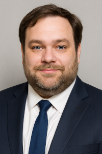

+++
title = "About Fearless Geek Media"
+++

 Started by PKA Will Michaels, Fearless Geek Media serves clients in
Salt Lake City, Utah and beyond FEARLESSLY, helping you stand out from
the crowd with professional website design and development, graphic design,
social media management, and more.

To get started, you'll want to schedule a discovery session. A discovery
session is a one-hour consultation where you can share your vision, goals,
challenges and expectations for your digital branding project. During the
discovery session, we will ask you questions, listen to your needs, offer
suggestions and brainstorm ideas with you. The discovery session is a great
way to get to know each other and see if Fearless Geek Media is the right fit
for you. You can choose to have the session in person or via video call.
After the session, Fearless Geek Media will send you a summary of what was
discussed and the next steps to move forward with your project. We would love
to hear from you and help you create a digital branding strategy that suits
your needs and budget.

Fearless Geek Media recognizes that it's not "one size fits all" and each client will have different needs. But we can give you an idea of how much it may cost. Please check out our pricing guide to get an idea of how much your project might be.
