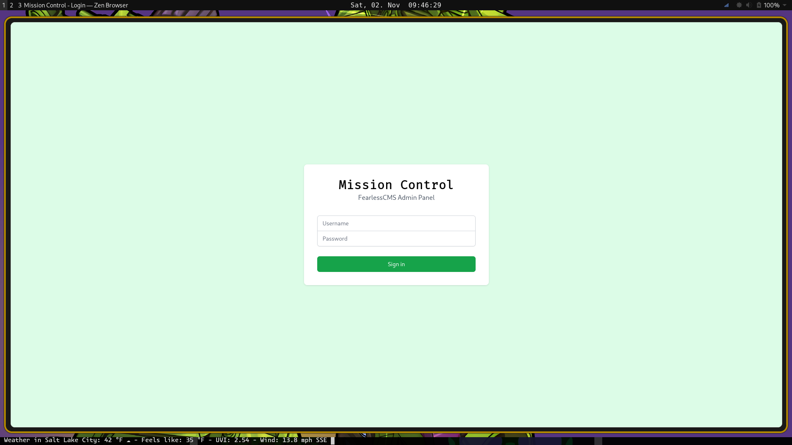
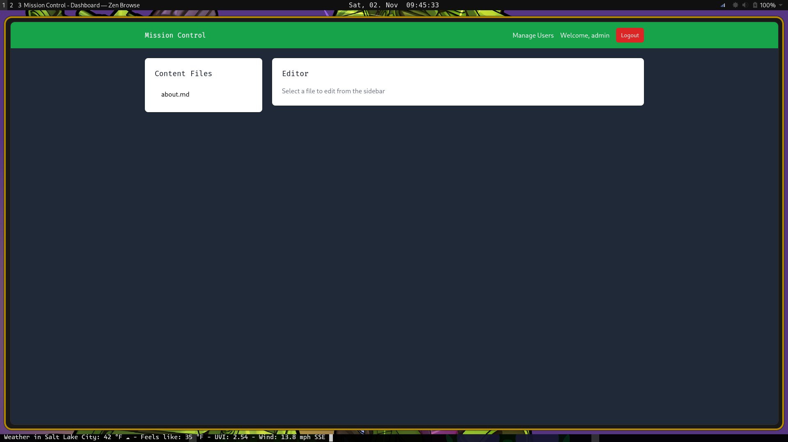

+++
title = "Fearless Geek Media - FearlessCMS: In progress"
date = 2024-12-31
+++

FearlessCMS is a flat-file content management system that I'm currently developing.

The plan is for it to include e-commerce support out of the box, and to use modern web technologies.

# FearlessCMS Manifesto

For years, the World Wide Web has been dominated by content management systems that have become bloated and clunky over time. **FearlessCMS** strives to be different.

Open-source projects must respect both the users of the software and the developers who contribute to it. FearlessCMS will adhere to these principles by fostering an inclusive, transparent, and collaborative environment for all contributors.

## Fearless Geek Media declares the following in the making of FearlessCMS:

1. **FearlessCMS will respect the culture and spirit of open-source software.**
   - Contributors are encouraged to improve, distribute, and use the code for commercial or non-commercial purposes, as long as proper attribution is given to developers and contributors.
   - All trademarks associated with the original project can be used freely by others, without restriction.
   - Input from designers, developers, and users is welcome and integral to the platform's success. This is an open-source project for the community and by the community.

2. **Templates should be templates. Plugins should be plugins.**
   - In many modern platforms, themes and templates have taken on functionality that should be provided by plugins, introducing unnecessary complexity.
   - In FearlessCMS, themes and templates are not to include plugin functionality, and plugins should be clearly declared dependencies, well-documented, and disclosed upfront.
   - Themes and templates will consist only of **HTML, CSS, and JavaScript** (or languages that compile to JavaScript like Coffeescript or Hyperscript), with minimal JavaScript to limit potential attack vectors.

3. **FearlessCMS will evolve with technology.**
   - Technology is constantly advancing. FearlessCMS commits to embracing new, secure, faster, and more efficient technologies to improve the platform.
   - Every two years after the initial launch, the codebase will be reviewed for efficiency and overhauled if necessary to ensure continued evolution and relevance.

4. **Security and privacy are non-negotiable.**
   - FearlessCMS will prioritize the protection of user data and safeguard the platform from security vulnerabilities.
   - Regular security audits and prompt patching of vulnerabilities are essential parts of the development cycle.

5. **The platform will remain lightweight and performance-driven.**
   - Bloat is the enemy. The CMS will be designed to be as lightweight as possible without compromising functionality. This ensures a fast, responsive experience for both developers and end-users.

6. **Accessibility and inclusivity are core values.**
   - FearlessCMS will follow web standards to ensure the platform is accessible to users with disabilities, including adherence to **WCAG** guidelines.
   - An inclusive community where everyone, regardless of skill level or background, is encouraged to participate, share knowledge, and grow together is central to the project's ethos.

7. **Ethical development and use.**
   - Developers contributing to FearlessCMS will uphold ethical programming standards, prioritizing user safety, privacy, and the open web.
   - FearlessCMS will not tolerate contributions that introduce unethical practices, such as data mining, surveillance, or exploitation of vulnerabilities.

8. **Sustainability in software development.**
   - The project recognizes the environmental impact of large-scale web services. FearlessCMS will strive to use efficient code and consider its carbon footprint, aiming to reduce unnecessary resource usage.

---

*The ideas in section 2 were contributed by James Potts.*

---

### Conclusion:

With these policies in place, FearlessCMS seeks to create a platform that is lightweight, secure, and accessible, but most importantly, it is a CMS **for the people**. Whether you are a developer, a designer, or a casual user, FearlessCMS will respect your needs and provide a toolset for creating websites that empower the open web and its diverse community.

---

### Support is needed:

Development of this CMS is underway. Feel free to financially support development of FeralessCMS on [Ko-Fi](https://ko-fi.com/fearlessgeekmedia)!. We will be releasing source code soon.

