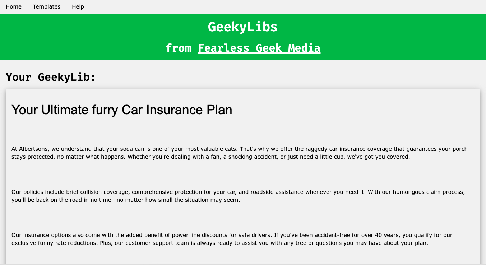
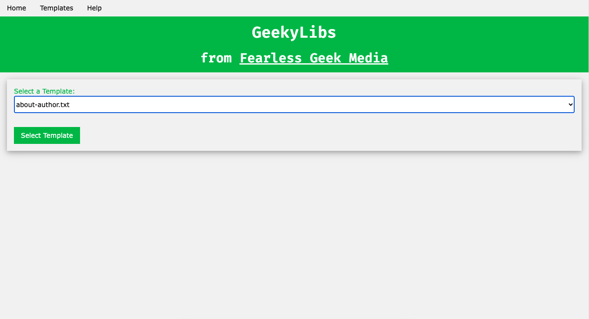
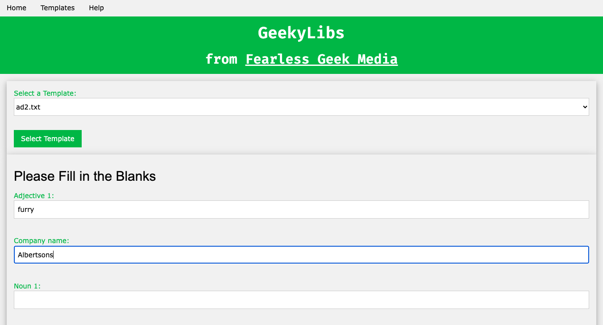

+++
title = "Fearless Geek Media - GeekyLibs" 
author = "Fearless Geek Media"
date = "2025-03-30"
description = "GeekyLibs - a Mad Libs clone"
+++

This is a clone of Mad Libs that I created while I was in a mental health treatment program. I was limited in the time I had at the computer but managed to crank this out.

I was inspired by a Mad Libs application that I had with some games on my first computer.

I even created a Template tester and included instructions on how to create templates. You can also submit templates.

<a href="https://geekylibs.infinityfreeapp.com" target="_blank">Click here for GeekyLibs</a>

<a href="https://github.com/fearlessgeekmedia/GeekyLibs" target="_blank">Click here for source code</a>
