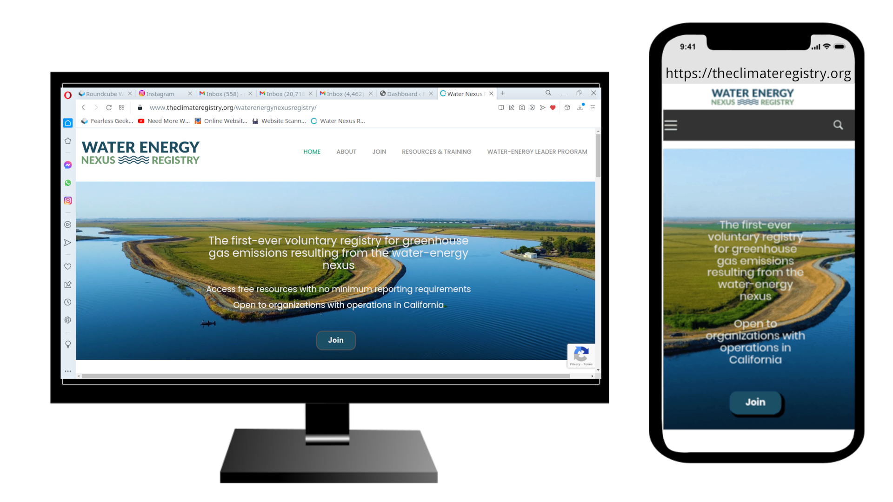
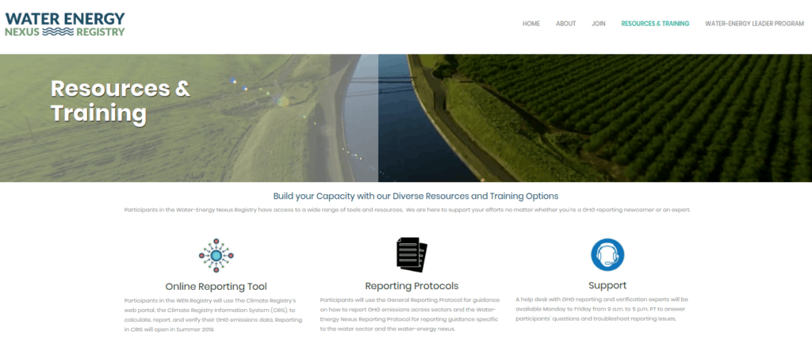
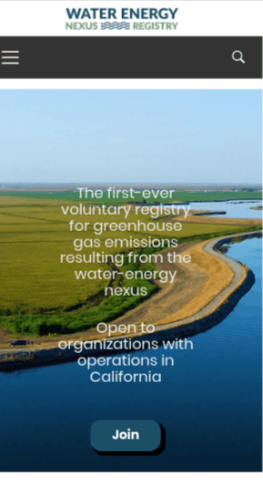

+++
title = "Fearless Geek Media - Water Nexus Registry"
date = "2018-08-30"
+++

A website I did for The Climate Registry, based in California.

The Water Nexus Registry was a new project started by The Climate Registry focusing on waterways.

Both The Climate Registry and Water Nexus Registry websites have sense been redesigned to match each other. 
